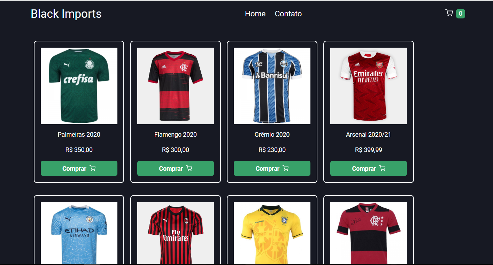

### Projeto Dio Shopping

O projeto é um dos desafios do bootcamp Inter Frontend Developer juntamente com a Digital Inovation One (Dio)

## Começando

Para rodar o backend execute os comandos abaixo.

```bash
cd api-dioshopping

yarn

yarn dev

```

Para rodar o frontend execute os comandos abaixo.

```bash
cd front-dioshopping

yarn

yarn dev

```

Abra [http://localhost:3000](http://localhost:3000) com seu navegador para ver o resultado.

### ScreenShots



...
